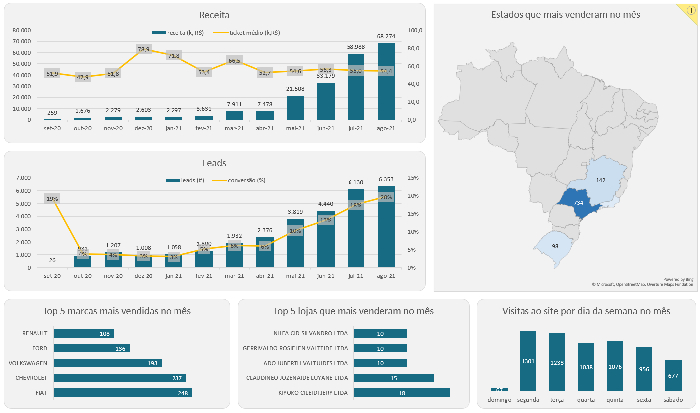

# Análise de Dados de Vendas com SQL

Este projeto foi desenvolvido como parte do curso **“SQL para Análise de Dados: Do básico ao avançado”**, ministrado por **Midori Toyota**.

O objetivo do projeto é aplicar conceitos fundamentais de SQL voltados para **análise de dados**, utilizando um conjunto de dados de vendas fictício, e transformar os resultados em análises e visualizações no Excel.

---

## 🎯 Objetivo do Projeto

Analisar o desempenho de vendas a partir de diferentes perspectivas, incluindo:

- Evolução mensal do funil (leads, vendas, receita, conversão e ticket médio)
- Estados com maior número de vendas
- Marcas com maior volume de vendas
- Lojas com melhor desempenho
- Dias da semana com maior número de visitas ao site

---

## 🛠️ Ferramentas Utilizadas

- SQL (PostgreSQL)
- Excel (análise e visualização dos dados)

---

## 📊 Análises Realizadas

As análises abaixo foram desenvolvidas em SQL, com foco em responder perguntas de negócio a partir dos dados de vendas:

- **[Análise mensal do funil de vendas](queries/query_1_funil_mensal.sql)**  
  Consolidação mensal de leads, vendas, receita, taxa de conversão e ticket médio.

- **[Estados com maior número de vendas](queries/query_2_vendas_por_estado.sql)**  
  Identificação dos estados com melhor desempenho em vendas no período analisado.

- **[Marcas com maior volume de vendas](queries/query_3_vendas_por_marca.sql)**  
  Análise das marcas mais vendidas no mês.

- **[Lojas com melhor desempenho em vendas](queries/query_4_vendas_por_loja.sql)**  
  Ranking das lojas com maior número de vendas.

- **[Dias da semana com maior número de visitas](queries/query_5_visitas_por_dia_semana.sql)**  
  Análise do comportamento de visitas ao site ao longo da semana.

---

## 📈 Dashboard

Os resultados das queries foram exportados para o Excel, onde foi construído um dashboard com gráficos e indicadores para facilitar a análise visual dos dados.




---

## 📂 Estrutura do Repositório
```text
📁 queries
 ├── query_1_funil_mensal.sql
 ├── query_2_vendas_por_estado.sql
 ├── query_3_vendas_por_marca.sql
 ├── query_4_vendas_por_loja.sql
 ├── query_5_visitas_por_dia_semana.sql

📁 dashboard
 └── dashboard_excel.png

README.md
